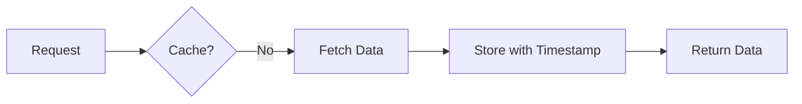
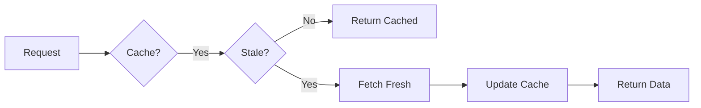
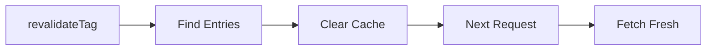
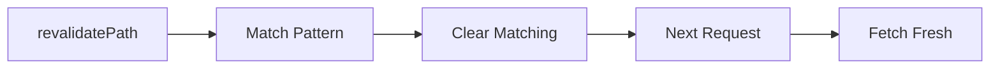

# Cache Lifecycle in Nuxt

This document explains the cache lifecycle for the Next.js-style caching functionality in Nuxt.

## Cache Lifecycle Overview

The cache lifecycle follows these stages:

1. **Initial Request** → Cache Miss → Fetch Data → Store in Cache
2. **Subsequent Requests** → Cache Hit → Return Cached Data
3. **Revalidation** → Cache Stale → Fetch Fresh Data → Update Cache
4. **Invalidation** → Manual Trigger → Clear Cache → Next Request Fetches Fresh

## Detailed Flow

### 1. First Request (Cache Miss)



```ts
// First call - cache miss
const { data } = await useFetch('/api/posts', {
  revalidate: 60,
  tags: ['posts']
})
// ✓ Fetches from API
// ✓ Stores in cache with timestamp
// ✓ Associates with 'posts' tag
```

### 2. Subsequent Request (Cache Hit)



```ts
// Second call within 60 seconds - cache hit
const { data } = await useFetch('/api/posts', {
  revalidate: 60,
  tags: ['posts']
})
// ✓ Returns cached data immediately
// ✗ Does not fetch from API
```

### 3. Time-based Revalidation

After the `revalidate` time expires, the cache is considered stale:

```ts
// After 60 seconds - cache stale
const { data } = await useFetch('/api/posts', {
  revalidate: 60,
  tags: ['posts']
})
// ✓ Detects cache is stale (> 60 seconds old)
// ✓ Fetches fresh data from API
// ✓ Updates cache with new timestamp
// ✓ Returns fresh data
```

### 4. Tag-based Invalidation



```ts
// Manual invalidation
revalidateTag('posts')
// ✓ Clears all cache entries tagged with 'posts'
// ✓ Updates tag index

// Next request
const { data } = await useFetch('/api/posts', {
  revalidate: 60,
  tags: ['posts']
})
// ✓ Cache miss (was cleared)
// ✓ Fetches fresh data
// ✓ Re-establishes cache
```

### 5. Path-based Invalidation



```ts
// Clear specific path
revalidatePath('/api/posts/123')
// ✓ Clears cache for exact path

// Clear with wildcard
revalidatePath('/api/posts/*')
// ✓ Clears all paths matching pattern
// ✓ e.g., /api/posts/1, /api/posts/2, etc.
```

## Cache Strategies

### Default Strategy

```ts
const { data } = await useFetch('/api/data', {
  cacheStrategy: 'default',
  revalidate: 60
})
```

- Uses cache if available and not stale
- Fetches fresh data if cache is stale or missing
- **Lifecycle**: Cache → Check Staleness → Return or Refetch

### Force Cache Strategy

```ts
const { data } = await useFetch('/api/static', {
  cacheStrategy: 'force-cache',
  revalidate: false
})
```

- Always uses cache if available
- Only fetches if cache is empty
- Never revalidates automatically
- **Lifecycle**: Cache → Return (always) or Initial Fetch

### No Store Strategy

```ts
const { data } = await useFetch('/api/realtime', {
  cacheStrategy: 'no-store'
})
```

- Never caches data
- Always fetches fresh
- **Lifecycle**: Fetch → Return (no cache)

## Cache Storage

The cache is stored in the Nuxt app instance:

```ts
interface CacheEntry {
  data: any              // The cached data
  timestamp: number      // When it was cached (Date.now())
  revalidate?: number    // Revalidation time in seconds
  tags?: string[]        // Associated tags
}

interface CacheStore {
  entries: Map<string, CacheEntry>     // Key → Entry
  tagIndex: Map<string, Set<string>>   // Tag → Set of Keys
}
```

### Storage Location

- **Client-side**: In-memory storage in `nuxtApp._cacheStore`
- **Server-side**: Per-request storage in SSR context
- **Persistence**: Not persistent across page reloads (in-memory only)

## Best Practices

### 1. Choose Appropriate Revalidation Times

```ts
// Static content - long revalidation
const { data: config } = await useFetch('/api/config', {
  revalidate: 3600 // 1 hour
})

// Dynamic content - short revalidation
const { data: notifications } = await useFetch('/api/notifications', {
  revalidate: 30 // 30 seconds
})

// Real-time data - no cache
const { data: live } = await useFetch('/api/live-data', {
  cacheStrategy: 'no-store'
})
```

### 2. Use Tags for Related Data

```ts
// Tag all user-related data
const { data: profile } = await useFetch('/api/profile', {
  revalidate: 300,
  tags: ['user', 'profile']
})

const { data: settings } = await useFetch('/api/settings', {
  revalidate: 300,
  tags: ['user', 'settings']
})

// Invalidate all user data at once
function logout() {
  revalidateTag('user')
}
```

### 3. Combine Strategies

```ts
// Use both time-based and tag-based
const { data: posts } = await useFetch('/api/posts', {
  revalidate: 60,      // Auto-refresh after 60s
  tags: ['posts']       // Manual invalidation available
})

// Manual update
async function createPost(post) {
  await $fetch('/api/posts', { method: 'POST', body: post })
  revalidateTag('posts')  // Immediate invalidation
}
```

### 4. Path Patterns for Hierarchical Data

```ts
// Cache with path patterns
const { data: post } = await useFetch(`/api/posts/${id}`)

// Clear specific post
revalidatePath(`/api/posts/${id}`)

// Clear all posts
revalidatePath('/api/posts/*')

// Clear everything
revalidatePath('*')
```

## Performance Considerations

### Cache Hit Rate

Monitor cache effectiveness:

```ts
const keys = getCacheKeys()
console.log(`Cache has ${keys.length} entries`)

const tags = getCacheTags()
console.log(`Using ${tags.length} tags`)
```

### Memory Management

- Cache grows with usage
- Use appropriate revalidation times to prevent unlimited growth
- Consider clearing cache on navigation if needed:

```ts
// Clear cache when navigating away
onBeforeRouteLeave(() => {
  clearCache()
})
```

## Examples

### E-commerce Product Listing

```ts
// Product list with category tagging
const { data: products } = await useFetch('/api/products', {
  revalidate: 300,
  tags: ['products', category]
})

// Update when product changes
async function updateProduct(id) {
  await $fetch(`/api/products/${id}`, { method: 'PUT', body: data })
  revalidateTag('products')
  revalidatePath(`/api/products/${id}`)
}
```

### User Dashboard

```ts
// User data with multiple endpoints
const { data: user } = await useFetch('/api/user', {
  revalidate: 300,
  tags: ['user']
})

const { data: stats } = await useFetch('/api/user/stats', {
  revalidate: 60,
  tags: ['user', 'stats']
})

// Refresh all user data
function refreshUserData() {
  revalidateTag('user')
}
```

### Blog Posts with Comments

```ts
// Post content (changes rarely)
const { data: post } = await useFetch(`/api/posts/${id}`, {
  revalidate: 600,
  tags: ['posts', `post-${id}`]
})

// Comments (changes frequently)
const { data: comments } = await useFetch(`/api/posts/${id}/comments`, {
  revalidate: 30,
  tags: ['comments', `post-${id}-comments`]
})

// Update only comments
function addComment() {
  revalidateTag(`post-${id}-comments`)
}

// Update entire post
function updatePost() {
  revalidateTag(`post-${id}`)
}
```
